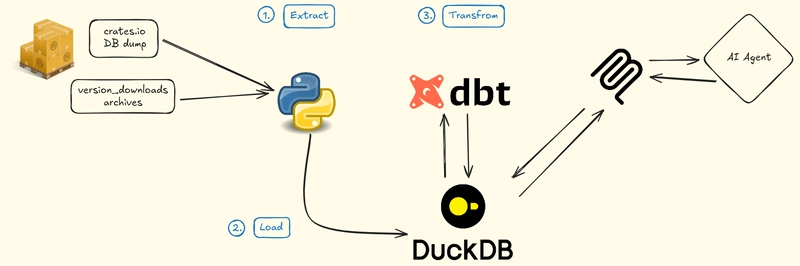
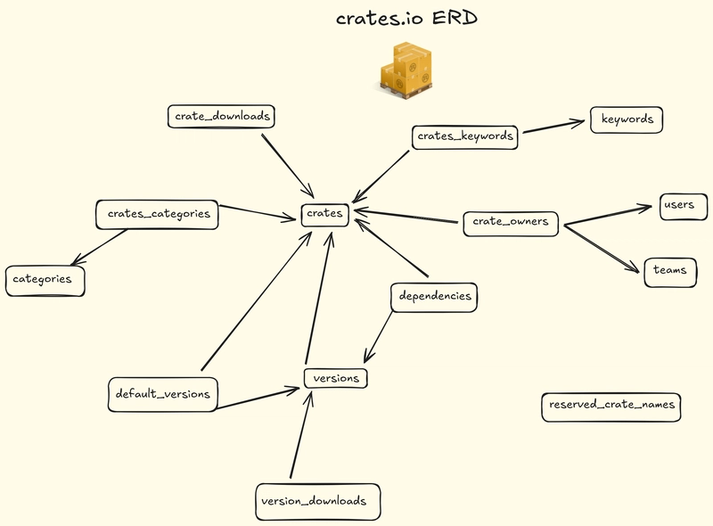

# Rust Crates Analytics

**Version**: 1.0

This project lets you analyze Rust Crates Ecosystem locally on your machine. You can query the data directly with your DB Client that supports DuckDB or use AI agent to connect to the local MCP server here. Includes a Streamlit dashboard with example visualizations for reference.

## Features

- Right at the setup, 3 months of available data in `staging.stg_version_downloads`
- dbt transformations for data quality checks and data contract enforcement
- Incremental ingestion pipeline for `staging.stg_version_downloads`, full refresh on all other tables
- Backfill historical data from `version_downloads` archives by date or number of days
- MCP HTTP Server ready for use after the setup

## Prerequisites

- uv installed (>=0.9.7)
- Minimum 15GB free space

## Architecture

This project is following an ELT Data Warehouse pattern with transformations from `raw` -> `staging` with possibilities to add -> `marts` as well.

The idea is that `raw` schema is the true state of the downloaded crates.io DB dump, while `staging` contains the full refresh of all tables from `raw` except for `staging.stg_version_downloads`, where we implement the incremental strategy for both updates and backfills. We implement this using Python and dbt with DuckDB engine.




## Data Model



## Project Setup

To setup the Rust Crates Analytics project, run the command

```bash
uv sync
uv run setup.py
```

This script will do the following:

0. Sync uv project (Python + dependencies)
1. Download crates.io database dump (will take ~5GB of storage)
2. Create DuckDB schemas
3. Load 3 months of data (will take ~5GB of storage)
4. Run dbt transformations and tests with `dbt build`


If you want to refresh your tables and update version_downloads table, run

```bash
uv run update.py
```

This will do the following:

1. Download latest crates.io database dump
2. Recreate all raw tables from dump (crates, versions, etc.)
3. Checking the freshness of the updated raw schema
4. Running dbt transformations (incremental mode for version_downloads, others full refresh) and tests


If you wish do to the backfill, trigger the backfill script with either backfill to date or backfill days:

```bash
uv run scripts/ingest_vd_archives.py --backfill-to-date <YYYY-MM-DD>
```

OR

```bash
uv run scripts/ingest_vd_archives.py --backfill-days <INT>
```

## MCP Setup

If you wish to use the MCP to analyze Rust Crates Analytics project with an AI agent that has MCP client, you can do that with:

```bash
uv run mcp/mcp_duckdb_http.py
```

Example on how to add HTTP MCP for Claude Code:

```bash
claude mcp add --transport duckdb_crates http://127.0.0.1:8000/mcp
```

You can also add the stdio MCP server if you want

```bash
claude mcp add duckdb_crates_stdio /path/to/project/.venv/bin/python /path/to/project/mcp/mcp_duckdb_server.py
```

Verify it with

```bash
claude mcp list
```

You should see _Connected_.

Then trigger the prompt

```bash
/setup_crates_analytics_context
```

to load the context of the Rust Crates Analytics project with preloaded prompt and have fun discovering and chatting!